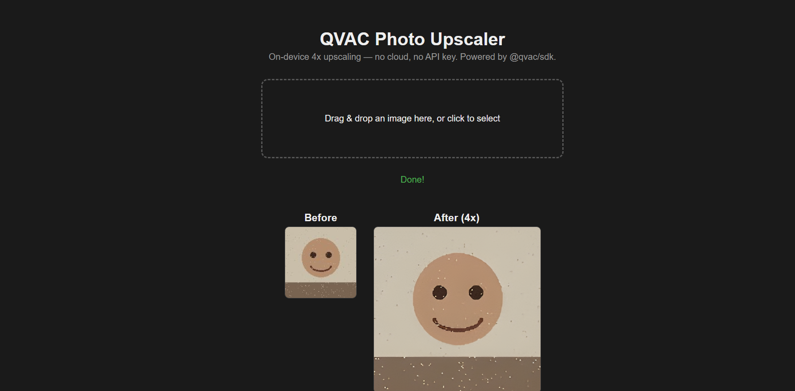

# QVAC Photo Upscaler

A small app that upscales low-resolution photos 4x entirely on-device using Tether's QVAC SDK — no cloud API, no usage bill, no data ever leaves your machine.

Comes in two modes: a CLI for quick single-file upscaling, and a drag-and-drop web UI for a friendlier before/after experience.

## What it does

Takes a low-resolution image and upscales it 4x using the Real-ESRGAN model, running fully locally via QVAC's `upscale()` function.

## QVAC SDK functions used

- `loadModel()` — loads the `REALESRGAN_X4PLUS` model in standalone upscale mode
- `upscale()` — runs the actual on-device upscaling
- `unloadModel()` — releases the model (CLI mode only)

## SDK version

`@qvac/sdk ^0.19.1`

## Install

```
npm install
```

## Run — CLI mode

```
node index.js <input-image> <output-image>
```

Example:

```
node index.js sample-lowres.jpg output.png
```

## Run — Web UI mode

```
node server.js
```

Then open `http://localhost:3000` in your browser and drag an image into the dropzone. The before/after result appears side by side once processing finishes.

On first run (either mode), the model downloads automatically (a few hundred MB). Subsequent runs use the cached model and run fully offline.

## Screenshot



## License

MIT
